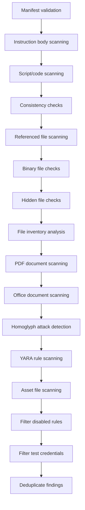

# Static Analyzer

::: tip TL;DR
The static analyzer runs 14 detection passes per skill covering YAML signatures, YARA rules, Python checks, binary inspection, document analysis, and homoglyph detection. It is always-on (core analyzer) and requires no external services.
:::

The static analyzer is the primary deterministic detection engine. It combines YAML signature matching, YARA-X rule scanning, Python-based checks, and file inventory analysis to detect security threats without requiring external services.

<small>Source: [`skill_scanner/core/analyzers/static.py`](https://github.com/cisco-ai-defense/skill-scanner/blob/main/skill_scanner/core/analyzers/static.py)</small>

## Analysis Flow

The `analyze()` method performs multi-pass scanning in the following order:

Each pass targets a different aspect of the skill package:

| Pass | Method | What it checks |
|---|---|---|
| Manifest | `_check_manifest()` | Skill name, description, frontmatter integrity |
| Instruction body | `_scan_instruction_body()` | SKILL.md content against signature rules |
| Script scanning | `_scan_scripts()` | Python/bash/other scripts against signatures |
| Consistency | `_check_consistency()` | Mismatch between manifest claims and actual behavior |
| Referenced files | `_scan_referenced_files()` | Files mentioned in SKILL.md instructions |
| Binary files | `_check_binary_files()` | Extension/magic mismatch, archive detection, unknown binaries |
| Hidden files | `_check_hidden_files()` | Dotfiles, `__pycache__`, policy-allowed exceptions |
| File inventory | `_check_file_inventory()` | Package anomalies (file count, types, sizes) |
| PDF documents | `_check_pdf_documents()` | Structural analysis via pdfid for suspicious elements |
| Office documents | `_check_office_documents()` | VBA macros and suspicious OLE indicators |
| Homoglyphs | `_check_homoglyph_attacks()` | Unicode homoglyph attacks in code files |
| YARA | `_yara_scan()` | YARA-X rule matches across all eligible files |
| Asset files | `_scan_asset_files()` | Non-script assets against signature rules |
| Allowed tools | `_check_allowed_tools_violations()` | Code behavior vs allowed-tools restrictions |

## Rule Sources

### YAML Signatures

<small>Source: [`skill_scanner/data/packs/core/signatures/`](https://github.com/cisco-ai-defense/skill-scanner/tree/main/skill_scanner/data/packs/core/signatures/)</small>

Loaded by `RuleLoader` ([`skill_scanner/core/rules/patterns.py`](https://github.com/cisco-ai-defense/skill-scanner/blob/main/skill_scanner/core/rules/patterns.py)), each `SecurityRule` includes:

- `id` -- unique rule identifier
- `category` -- maps to `ThreatCategory` enum
- `severity` -- maps to `Severity` enum
- `patterns` -- list of regex patterns (compiled at load time)
- `exclude_patterns` -- optional patterns that suppress matches
- `file_types` -- optional file type scope (e.g., python-only rules)
- `description` and `remediation` -- human-readable context

Signature files cover: command injection, data exfiltration, hardcoded secrets, obfuscation, privilege escalation, and more.

### YARA Rules

<small>Source: [`skill_scanner/data/packs/core/yara/`](https://github.com/cisco-ai-defense/skill-scanner/tree/main/skill_scanner/data/packs/core/yara/)</small>

Scanned by `YaraScanner` ([`skill_scanner/core/rules/yara_scanner.py`](https://github.com/cisco-ai-defense/skill-scanner/blob/main/skill_scanner/core/rules/yara_scanner.py)). YARA rules detect complex multi-pattern threats that are difficult to express as individual regex signatures, such as tool chaining, system manipulation, and prompt injection.

### Python-Based Checks

<small>Source: [`skill_scanner/data/packs/core/python/`](https://github.com/cisco-ai-defense/skill-scanner/tree/main/skill_scanner/data/packs/core/python/)</small>

Programmatic checks registered via the pack manifest (`pack.yaml`). These handle detection logic that requires more than pattern matching, such as trigger quality checks, manifest validation, allowed tools enforcement, and analyzability scoring.

### Pack Manifest

<small>Source: [`skill_scanner/data/packs/core/pack.yaml`](https://github.com/cisco-ai-defense/skill-scanner/blob/main/skill_scanner/data/packs/core/pack.yaml)</small>

The pack manifest registers all rule sources and metadata for the core detection pack.

## Detection Coverage

- Prompt injection
- Command/code injection
- Data exfiltration
- Obfuscation (encoding tricks, steganography patterns)
- Hardcoded credentials and secrets
- Archive/binary risks
- Tool mismatch and manifest consistency
- Hidden file and dotfile risks
- Document-embedded threats (PDF, Office macros)
- Unicode homoglyph attacks
- File inventory anomalies

## Policy-Aware Behavior

Static analysis behavior is shaped by several policy sections:

- **Rule scoping** (`rule_scoping`) -- file and path inclusion, documentation-path demotion/suppression
- **Docs demotion** -- findings in doc paths can be suppressed or severity-demoted
- **File classification** -- inert/structured/archive extension lists control binary check behavior
- **Severity overrides** -- promote or demote specific rules
- **Disabled rules** -- skip individual rule IDs entirely
- **Credential policy** -- known test values are filtered from hardcoded secret findings
- **Deduplication** -- overlapping findings from multiple scan passes are collapsed when enabled

## Custom Rules

- Validate custom signature sets with `skill-scanner validate-rules`
- Replace rule directory at runtime with `--custom-rules`

## Related Pages

- [Writing Custom Rules](/architecture/analyzers/writing-custom-rules)
- [Custom Policy Configuration](/user-guide/custom-policy-configuration)
- [Binary Handling](/architecture/binary-handling)
