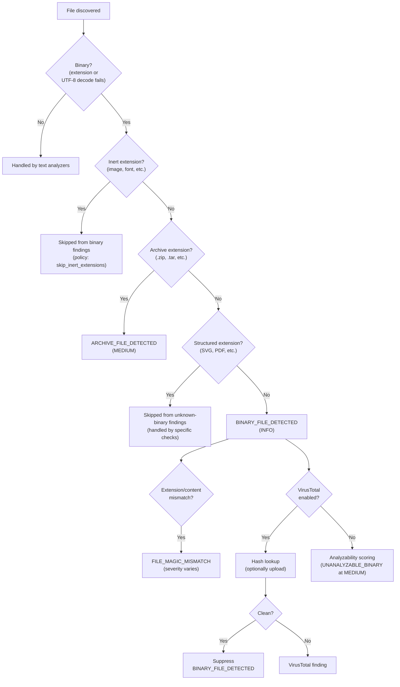

# Binary File Handling

::: tip TL;DR
Binaries are classified by extension and magic bytes, then tiered as inert, archive, structured, or unknown. Opaque binaries lower the analyzability score -- a fail-closed posture where what cannot be inspected is flagged rather than trusted. VirusTotal integration provides reputation-based validation.
:::

## Overview

Skill Scanner treats opaque binaries as reduced-visibility risk, not immediate proof of malware. Binary handling is split across static analysis, analyzability scoring, optional VirusTotal checks, and policy knobs.

## Classification Flowchart



## Current Implementation

### 1. Loader Classification

[`skill_scanner/core/loader.py`](https://github.com/cisco-ai-defense/skill-scanner/blob/main/skill_scanner/core/loader.py) classifies files as `binary` when:

- extension matches known binary extensions (`.exe`, `.so`, `.dylib`, `.dll`, `.bin`)
- file content cannot be decoded as UTF-8 during discovery

### 2. Static Analyzer Binary Checks

[`skill_scanner/core/analyzers/static.py::_check_binary_files`](https://github.com/cisco-ai-defense/skill-scanner/blob/main/skill_scanner/core/analyzers/static.py) applies tiered behavior:

- **Extension/content mismatch** (`FILE_MAGIC_MISMATCH`): generated for mismatches on any file, severity depends on mismatch type/confidence
- **Inert extensions**: skipped (images/fonts/etc., policy-controlled)
- **Structured extensions**: skipped from unknown-binary findings (for example SVG/PDF buckets, policy-controlled)
- **Archive extensions**: `ARCHIVE_FILE_DETECTED` at `MEDIUM`
- **Unknown binary files**: `BINARY_FILE_DETECTED` at `INFO`

### 3. Analyzer-Agnostic Risk Escalation

[`skill_scanner/core/scanner.py`](https://github.com/cisco-ai-defense/skill-scanner/blob/main/skill_scanner/core/scanner.py) adds analyzability-based findings:

- `UNANALYZABLE_BINARY` at `MEDIUM` for non-inert opaque binaries
- `LOW_ANALYZABILITY` aggregate findings when too much content is opaque

This is the primary fail-closed behavior for binary-heavy skills.

### 4. VirusTotal Integration

When `--use-virustotal` is enabled:

- binaries are hashed and checked against VirusTotal
- optionally upload unknown files with `--vt-upload-files`
- `BINARY_FILE_DETECTED` can be suppressed for binaries validated by VirusTotal

## Policy Controls

Binary behavior is tuned through scan policy sections:

- `file_classification.inert_extensions`
- `file_classification.structured_extensions`
- `file_classification.archive_extensions`
- `file_classification.skip_inert_extensions`
- `analysis_thresholds.min_confidence_pct` (magic mismatch confidence gate)
- `disabled_rules` (for example `BINARY_FILE_DETECTED`, `UNANALYZABLE_BINARY`)
- `severity_overrides` (for example promoting `BINARY_FILE_DETECTED` to `MEDIUM/HIGH`)

## Practical Guidance

- Keep binaries out of skill packages whenever possible; prefer auditable source scripts.
- If binaries are necessary, use `--use-virustotal` in CI and document provenance.
- Use policy overrides for org posture (strict compliance vs internal-trusted workflows).

## Example Commands

```bash
# Default scan (core analyzers)
skill-scanner scan /path/to/skill

# Include VirusTotal hash checks
skill-scanner scan /path/to/skill --use-virustotal

# Upload unknown binaries to VirusTotal as well
skill-scanner scan /path/to/skill --use-virustotal --vt-upload-files

# Apply stricter policy posture
skill-scanner scan /path/to/skill --policy strict
```

## Related Pages

- [Analyzer Selection Guide](/architecture/analyzers/meta-and-external-analyzers) -- When to enable VirusTotal and other optional analyzers
- [Static Analyzer](/architecture/analyzers/static-analyzer) -- How binary checks fit into the static analysis flow
- [Custom Policy Configuration](/user-guide/custom-policy-configuration) -- Tune binary handling via policy sections
