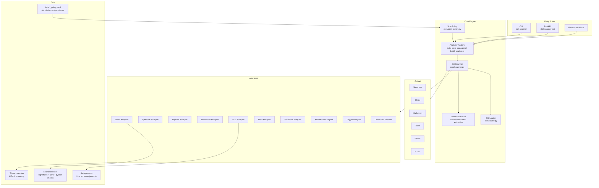

# Skill Scanner Architecture

> [!TIP]
> **What you'll find here**
>
> This section covers the internals of Skill Scanner: how scans execute, what each analyzer detects, how findings map to threat frameworks, and how to extend the system. If you're looking to **use** the scanner, start with the [User Guide](../user-guide/index.md) instead.

Skill Scanner is a modular security scanner for agent skill packages. It combines deterministic scanning with optional LLM-assisted analysis through a central orchestrator and pluggable analyzers.

## Explore by Topic

- **[Scanning Pipeline](./scanning-pipeline.md)** -- How scans execute end-to-end: two-phase analysis, post-processing, and output.
- **[Analyzers](./analyzers/index.md)** -- The 10 detection engines — capability matrix, deep dives, and selection guide.
- **[Threat Model](./threat-taxonomy.md)** -- Cisco AI Security Framework taxonomy, binary handling, and risk classification.
- **[Extending](./analyzers/writing-custom-rules.md)** -- Write custom YAML signatures, YARA rules, and Python checks. Add new analyzers.

## High-Level Layout

## Core Components

### Data Models

<small>Source: [`skill_scanner/core/models.py`](https://github.com/cisco-ai-defense/skill-scanner/blob/main/skill_scanner/core/models.py)</small>

Primary data structures:

- `SkillManifest`, `SkillFile`, `Skill`
- `Finding`, `ScanResult`, `Report`
- enums: `Severity`, `ThreatCategory`

`ScanResult` and `Report` expose computed safety/severity summaries and JSON-serializable output helpers.

### Loader

<small>Source: [`skill_scanner/core/loader.py`](https://github.com/cisco-ai-defense/skill-scanner/blob/main/skill_scanner/core/loader.py)</small>

`SkillLoader` is responsible for:

1. Validating skill directory and `SKILL.md`
2. Parsing frontmatter (`name`, `description`, optional metadata)
3. Discovering files recursively (excluding only `.git` internals)
4. Basic file-type classification (python/bash/markdown/binary/other)
5. Extracting referenced file hints from instruction content

### Analyzer Construction

<small>Source: [`skill_scanner/core/analyzer_factory.py`](https://github.com/cisco-ai-defense/skill-scanner/blob/main/skill_scanner/core/analyzer_factory.py)</small>

This is the single source of truth for analyzer assembly:

- `build_core_analyzers(policy, ...)`
  - static, bytecode, pipeline (gated by `policy.analyzers.*`)
- `build_analyzers(policy, ..., use_behavioral/use_llm/...)`
  - adds optional analyzers based on flags/params

CLI, API, pre-commit hook, eval runners, and fallback scanner paths all rely on this factory for parity.

### Scanner Orchestrator

<small>Source: [`skill_scanner/core/scanner.py`](https://github.com/cisco-ai-defense/skill-scanner/blob/main/skill_scanner/core/scanner.py)</small>

`SkillScanner` runs a two-phase scan pipeline for each skill:

1. **Load + preprocess** -- load skill, extract archives/embedded content via `ContentExtractor`
2. **Phase 1 (non-LLM)** -- all non-LLM analyzers (static, bytecode, pipeline, behavioral, VirusTotal, AI Defense, trigger)
3. **Phase 2 (LLM/meta)** -- LLM and meta analyzers receive enrichment context built from Phase 1 findings
4. **Post-processing** -- disabled rules enforcement, severity overrides, analyzability scoring, finding normalization/dedup, co-occurrence metadata, policy fingerprint attachment
5. **Cleanup** -- temporary extraction artifacts are removed; `ScanResult` is returned

For directory scans, `scan_directory(...)` iterates skill packages and optionally adds:

- description overlap findings (`TRIGGER_OVERLAP_*`)
- cross-skill findings via `CrossSkillScanner`

See [Scanning Pipeline](scanning-pipeline.md) for the full stage-by-stage breakdown.

### Analyzability Scoring

<small>Source: [`skill_scanner/core/analyzability.py`](https://github.com/cisco-ai-defense/skill-scanner/blob/main/skill_scanner/core/analyzability.py)</small>

`compute_analyzability()` evaluates how much of a skill's content the scanner could actually inspect. This implements a fail-closed posture: content the scanner cannot analyze is flagged rather than trusted.

- Per-file `UNANALYZABLE_BINARY` findings for opaque non-inert binaries
- Aggregate `LOW_ANALYZABILITY` findings when the overall score drops below policy thresholds
- Score and details are included in `ScanResult` metadata

### Supporting Modules

| Module | Purpose |
|---|---|
| [`command_safety.py`](https://github.com/cisco-ai-defense/skill-scanner/blob/main/skill_scanner/core/command_safety.py) | Command safety tier classification for pipeline analysis |
| [`file_magic.py`](https://github.com/cisco-ai-defense/skill-scanner/blob/main/skill_scanner/core/file_magic.py) | File magic number detection and extension/content mismatch checking |
| [`rule_registry.py`](https://github.com/cisco-ai-defense/skill-scanner/blob/main/skill_scanner/core/rule_registry.py) | Central registry for rule metadata and validation |
| [`strict_structure.py`](https://github.com/cisco-ai-defense/skill-scanner/blob/main/skill_scanner/core/strict_structure.py) | Skill package structure validation |

## Analyzer Inventory

### Core (policy-driven)

- `static_analyzer`: YAML signatures + YARA + inventory checks
- `bytecode_analyzer`: Python bytecode/source consistency checks
- `pipeline_analyzer`: shell pipeline taint analysis and command-risk checks

### Optional (flag/API-driven)

- `behavioral_analyzer`: static dataflow + cross-file/script correlation
- `llm_analyzer`: semantic threat analysis with structured schema output
- `meta_analyzer`: second-pass LLM validation/filtering (requires prior findings)
- `virustotal_analyzer`: binary hash lookup (+ optional upload)
- `aidefense_analyzer`: Cisco AI Defense cloud inspection
- `trigger_analyzer`: overly broad trigger/description checks

## Policy System

`ScanPolicy` ([`skill_scanner/core/scan_policy.py`](https://github.com/cisco-ai-defense/skill-scanner/blob/main/skill_scanner/core/scan_policy.py)) centralizes:

- file limits and thresholds
- rule scoping and docs-path behavior
- command safety tiers
- hidden file allowlists
- severity overrides and disabled rules
- output dedupe and metadata behavior
- core analyzer toggles

Built-in presets:

- `strict`
- `balanced` (default)
- `permissive`

## Entry Points

### CLI

<small>Source: [`skill_scanner/cli/cli.py`](https://github.com/cisco-ai-defense/skill-scanner/blob/main/skill_scanner/cli/cli.py)</small>

Commands:

- `scan`
- `scan-all`
- `list-analyzers`
- `validate-rules`
- `generate-policy`
- `configure-policy`
- `interactive`

Output formats: `summary`, `json`, `markdown`, `table`, `sarif`, `html`.

### API

<small>Source: [`skill_scanner/api/router.py`](https://github.com/cisco-ai-defense/skill-scanner/blob/main/skill_scanner/api/router.py)</small>

Current endpoints:

- `GET /`
- `GET /health`
- `POST /scan`
- `POST /scan-upload`
- `POST /scan-batch`
- `GET /scan-batch/{scan_id}`
- `GET /analyzers`

### Pre-commit Hook

<small>Source: [`skill_scanner/hooks/pre_commit.py`](https://github.com/cisco-ai-defense/skill-scanner/blob/main/skill_scanner/hooks/pre_commit.py)</small>

Scans staged or selected skill directories and blocks commit based on configured severity threshold.

## Reporting

Reporter implementations live in [`skill_scanner/core/reporters/`](https://github.com/cisco-ai-defense/skill-scanner/tree/main/skill_scanner/core/reporters):

- [`json_reporter.py`](https://github.com/cisco-ai-defense/skill-scanner/blob/main/skill_scanner/core/reporters/json_reporter.py)
- [`markdown_reporter.py`](https://github.com/cisco-ai-defense/skill-scanner/blob/main/skill_scanner/core/reporters/markdown_reporter.py)
- [`table_reporter.py`](https://github.com/cisco-ai-defense/skill-scanner/blob/main/skill_scanner/core/reporters/table_reporter.py)
- [`sarif_reporter.py`](https://github.com/cisco-ai-defense/skill-scanner/blob/main/skill_scanner/core/reporters/sarif_reporter.py)
- [`html_reporter.py`](https://github.com/cisco-ai-defense/skill-scanner/blob/main/skill_scanner/core/reporters/html_reporter.py)

All reporters consume `ScanResult` or `Report` model objects.

## Extension Points

To add new behavior safely:

1. Add analyzer class inheriting `BaseAnalyzer`
2. Register construction path in [`analyzer_factory.py`](https://github.com/cisco-ai-defense/skill-scanner/blob/main/skill_scanner/core/analyzer_factory.py)
3. Add policy knobs (if needed) in [`scan_policy.py`](https://github.com/cisco-ai-defense/skill-scanner/blob/main/skill_scanner/core/scan_policy.py)
4. Add/adjust tests under [`tests/`](https://github.com/cisco-ai-defense/skill-scanner/tree/main/tests)
5. Document CLI/API toggles in docs

For rule-based detection updates, prefer extending [`skill_scanner/data/packs/core/`](https://github.com/cisco-ai-defense/skill-scanner/tree/main/skill_scanner/data/packs/core) (signatures/YARA/python checks) before adding analyzer-level bespoke logic.
