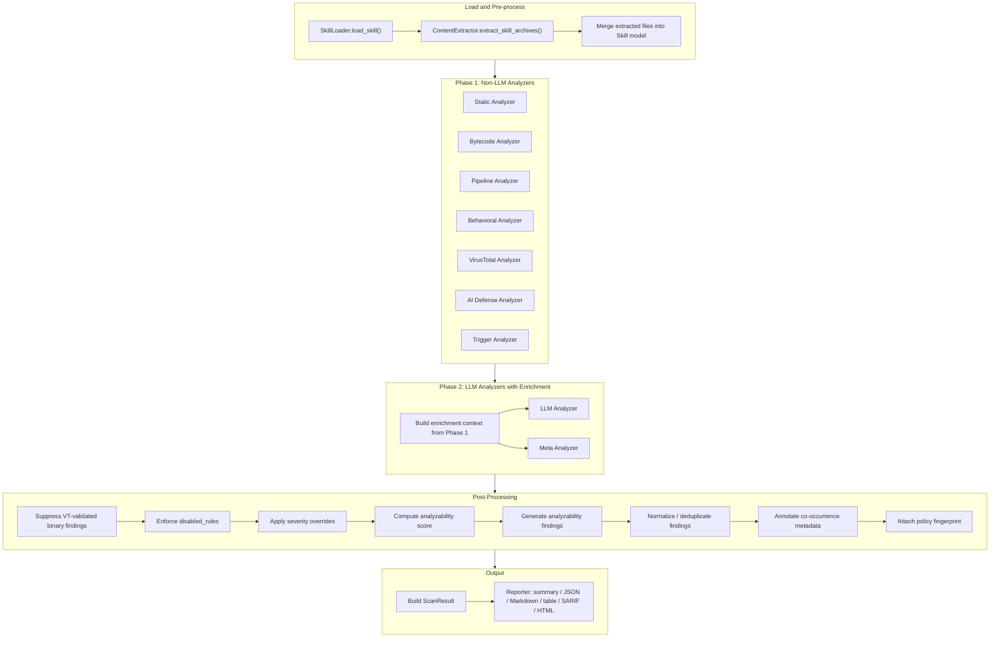

# Scanning Pipeline

::: tip TL;DR
Scans run in two phases: deterministic analyzers first (static, bytecode, pipeline, behavioral, VirusTotal, AI Defense, trigger), then LLM analyzers enriched with Phase 1 context. Post-processing applies policy overrides, analyzability scoring, and deduplication before producing the final report.
:::

This page describes the execution pipeline inside `SkillScanner`.

<small>Source: [`skill_scanner/core/scanner.py`](https://github.com/cisco-ai-defense/skill-scanner/blob/main/skill_scanner/core/scanner.py)</small>

## Pipeline Overview

## Stage 1: Load and Pre-process

1. **Load skill package** via `SkillLoader`:
   - Validate skill directory and `SKILL.md`
   - Parse frontmatter (name, description, metadata)
   - Discover files recursively (excluding `.git` internals)
   - Classify file types (python, bash, markdown, binary, other)
   - Extract referenced file hints from instruction content

2. **Extract archives** via `ContentExtractor`:
   - Process any archive files (ZIP, tar, etc.) embedded in the skill
   - Generate extraction findings for issues detected during extraction (zip bombs, path traversal attempts)
   - Merge extracted files back into the `Skill` model so analyzers see all content

## Stage 2: Phase 1 Analyzers (Non-LLM)

All non-LLM analyzers run in this phase. This includes both core analyzers (enabled by policy) and optional analyzers (enabled by flags/API params). The distinction between "core" and "optional" is about how they are constructed, not when they run.

**Core analyzers** (built by `build_core_analyzers`, gated by `policy.analyzers.*`):
- Static analyzer
- Bytecode analyzer
- Pipeline analyzer

**Optional analyzers** (added by `build_analyzers` when flags are set):
- Behavioral analyzer
- VirusTotal analyzer
- AI Defense analyzer
- Trigger analyzer

During Phase 1, the scanner also collects:
- **Validated binary files** from the VirusTotal analyzer (used to suppress duplicate findings later)
- **Unreferenced scripts** from the static analyzer (passed as enrichment context to LLM analyzers)

## Stage 3: Phase 2 Analyzers (LLM with Enrichment)

LLM and meta analyzers are deferred to Phase 2 so they can receive enrichment context built from Phase 1 results. An analyzer is deferred if its name is `llm_analyzer` or `meta_analyzer`.

**Enrichment context** includes:
- File inventory (total files, type distribution, unreferenced scripts)
- Magic mismatches detected in Phase 1
- Top critical/high severity static findings (up to 10 summaries)

This context is passed via `set_enrichment_context()`, giving the LLM a structured picture of what deterministic analysis already found.

After LLM analysis, the scanner captures the skill-level LLM assessment and primary threats for inclusion in scan metadata.

## Stage 4: Post-Processing

Between analysis and reporting, the scanner runs a series of normalization and policy enforcement steps:

1. **VirusTotal suppression** -- `BINARY_FILE_DETECTED` findings are removed for files that VirusTotal has validated
2. **Disabled rules enforcement** -- Findings matching `policy.disabled_rules` are stripped across all analyzers
3. **Severity overrides** -- `policy.severity_overrides` are applied, promoting or demoting finding severities
4. **Analyzability scoring** -- `compute_analyzability()` evaluates how much of the skill content could actually be inspected
5. **Analyzability findings** -- Fail-closed posture: `UNANALYZABLE_BINARY` (per-file) and `LOW_ANALYZABILITY` (aggregate) findings are generated for opaque content
6. **Finding normalization** -- Duplicate findings are collapsed based on policy-controlled dedup settings
7. **Co-occurrence metadata** -- Same-path rule co-occurrence annotations are attached (policy-controlled via `finding_output`)
8. **Policy fingerprint** -- Traceability metadata (policy hash, LLM assessment if available) is attached to findings

## Stage 5: Cleanup and Result

- Temporary extraction directories are always cleaned up, even if an analyzer raises an exception
- A `ScanResult` is built with findings, timing, analyzer names, analyzability score/details, and scan metadata

## Stage 6: Reporting

The `ScanResult` (or `Report` for multi-skill scans) is passed to a reporter:

| Format | Reporter | Notes |
|---|---|---|
| summary | (built-in) | Human-readable console output |
| json | `JSONReporter` | Machine-readable, supports `pretty` option |
| markdown | `MarkdownReporter` | Supports `detailed` option |
| table | `TableReporter` | Tabular console output |
| sarif | `SARIFReporter` | Static Analysis Results Interchange Format |
| html | `HTMLReporter` | Styled HTML report |

## Multi-Skill Scanning

When scanning a directory of skills via `scan_directory()`, additional steps run after individual skill scans:

- **Description overlap detection** -- `TRIGGER_OVERLAP_*` findings for skills with similar descriptions
- **Cross-skill analysis** -- `CrossSkillScanner.analyze_skill_set()` checks for data relay patterns, shared external URLs, complementary triggers, and shared suspicious patterns across the skill set

These are controlled by the `--check-overlap` flag in `scan-all`.

## Control Plane Inputs

| Source | Controls |
|---|---|
| CLI flags | Analyzer toggles, output format, policy preset, custom rules path |
| API request body | Same as CLI, plus upload and batch parameters |
| Policy preset/YAML | Thresholds, disabled rules, severity overrides, analyzer toggles |
| Environment variables | LLM provider credentials, VirusTotal API key, AI Defense URL/key, custom taxonomy paths |

## Related Pages

- [Architecture Overview](/architecture/) -- High-level system layout and component reference
- [Analyzers Overview](/architecture/analyzers/) -- Capability matrix and deep dives for each analyzer
- [Analyzer Selection Guide](/architecture/analyzers/meta-and-external-analyzers) -- Choose which optional analyzers to enable
- [Features](/features/) -- Feature catalog with pipeline diagram
