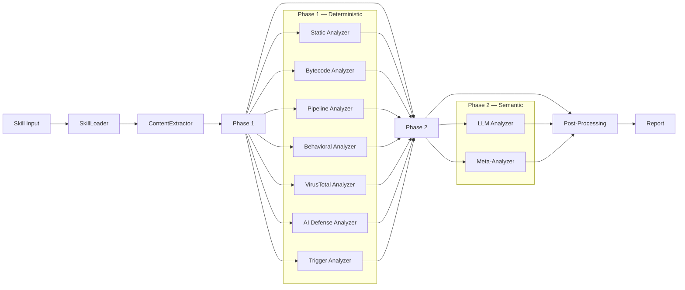

# Features

Cisco Skill Scanner is a layered security analysis tool for AI agent skill packages. It combines deterministic pattern matching, behavioral analysis, and LLM-powered reasoning to catch threats that any single approach would miss.

- **[Detect Threats](#multi-engine-threat-detection)** -- 10 analyzers, file intelligence engines, and analyzability scoring work together so no single blind spot dominates.
- **[Tune and Control](#policy-driven-control-plane)** -- 3 presets, 14 policy sections, severity overrides, and an interactive configurator -- all without code changes.
- **[Use Anywhere](#multiple-interfaces)** -- CLI for local dev, Python SDK for embedding, REST API for platforms, and pre-commit hooks for guardrails.
- **[Extend and Customize](#rule-system-extensibility)** -- YAML signatures, YARA rules, and Python checks -- add your own detection logic alongside the built-in rule packs.

## Multi-Engine Threat Detection

Skill Scanner layers multiple detection engines so that no single blind spot — pattern-matching misses, bytecode tricks, obfuscated pipelines — goes unchecked. Core analyzers run automatically on every scan; optional analyzers activate on demand when you need deeper analysis.

### Core analyzers (always on)

| Analyzer | What it does | Primary signal source |
|---|---|---|
| Static Analyzer | Pattern and signature detection | YAML signatures + YARA + Python checks |
| Bytecode Analyzer | `.pyc` consistency and integrity checks | Bytecode/source relationships |
| Pipeline Analyzer | Shell command chain risk analysis | Taint heuristics on command pipelines |

### Optional analyzers (opt-in)

| Analyzer | Enable flag | What you get |
|---|---|---|
| Behavioral Analyzer | `--use-behavioral` | AST and control-flow dataflow analysis for Python logic |
| LLM Analyzer | `--use-llm` | Semantic threat reasoning powered by LLM |
| Meta-Analyzer | `--enable-meta` | Second-pass false-positive reduction across all findings |
| VirusTotal Analyzer | `--use-virustotal` | Binary hash reputation and optional file uploads |
| AI Defense Analyzer | `--use-aidefense` | Cisco cloud-based threat classification |
| Trigger Analyzer | `--use-trigger` | Detection of vague or suspicious skill descriptions |
| Cross-Skill Scanner | `--check-overlap` | Coordinated attack detection across multiple skills |

> [!TIP]
> **Quick start**
> For local development, just run `skill-scanner scan ./skill` — the three core analyzers handle the common cases without any configuration.

<details>
<summary>What does each analyzer detect?</summary>

This matrix shows which threat categories each analyzer can produce findings for. Use it to decide which optional analyzers to enable for your use case.

| Threat Category | Static | Bytecode | Pipeline | Behavioral | LLM | Trigger | VirusTotal | AI Defense | Cross-Skill |
|---|:---:|:---:|:---:|:---:|:---:|:---:|:---:|:---:|:---:|
| Prompt Injection | ✓ | | | | ✓ | | | ✓ | |
| Command Injection | ✓ | | ✓ | ✓ | ✓ | | | ✓ | |
| Data Exfiltration | ✓ | | ✓ | ✓ | ✓ | | | ✓ | ✓ |
| Obfuscation | ✓ | ✓ | ✓ | | ✓ | | | ✓ | ✓ |
| Hardcoded Secrets | ✓ | | | | | | | ✓ | |
| Social Engineering | ✓ | | | | ✓ | ✓ | | ✓ | ✓ |
| Malware | | | | | | | ✓ | ✓ | |
| Resource Abuse | ✓ | | | | ✓ | | | | |
| Policy Violation | ✓ | | ✓ | ✓ | ✓ | | | ✓ | |
| Supply Chain | ✓ | | ✓ | | ✓ | | | | |
| Unauthorized Tool Use | ✓ | | | | ✓ | | | | |
| Harmful Content | | | | | ✓ | | | | |
| Skill Discovery Abuse | ✓ | | | | ✓ | | | | |
| Unicode Steganography | ✓ | | | | | | | | |
| Transitive Trust Abuse | ✓ | | | | | | | | |
| Autonomy Abuse | ✓ | | | | | | | | |
| Tool Chaining Abuse | ✓ | | | | | | | | |

**Reading guide**: The first three columns (Static, Bytecode, Pipeline) are core analyzers that always run. The remaining columns are optional analyzers you enable with flags. Multiple analyzers covering the same category means stronger detection — if one misses a pattern, another may catch it.
</details>

### File intelligence engines

Beyond code and text, Skill Scanner uses dedicated libraries to inspect binary and structured file content:

| Engine | What it catches |
|---|---|
| [Magika](https://github.com/google/magika) | AI-powered content-type detection for 200+ file types. Catches extension-vs-content mismatches (e.g. a `.txt` that's actually a ZIP). |
| pdfid | Risky PDF structures: `/JS`, `/JavaScript`, `/OpenAction`, `/Launch` |
| oletools | Office macros, auto-executable triggers, VBA, and OLE indicators |
| confusable-homoglyphs | Unicode deception — visually similar characters from different scripts |

### Analyzability scoring

Not all files can be inspected. Skill Scanner computes a per-skill analyzability score that tells you what fraction of the skill's content was actually analyzed. A low score means the skill contains files that resist inspection — a risk signal in itself.

<details>
<summary>How analyzability scoring works</summary>

- **Score formula**: `(analyzed_weight / total_weight) × 100` where weight = `max(1.0, log₂(file_size_bytes))`
- **Risk levels**: LOW (≥ 90%), MEDIUM (70–90%), HIGH (< 70%) — configurable via policy `analysis_thresholds`
- **Findings**: `UNANALYZABLE_BINARY` (per-file, MEDIUM) for opaque binaries; `LOW_ANALYZABILITY` (HIGH or MEDIUM) when the overall score is low
- **Fail-closed**: in strict policy mode, low analyzability triggers blocking findings
</details>

<details>
<summary>How the scan pipeline works</summary>



**SkillLoader** parses `SKILL.md` frontmatter and discovers files. **ContentExtractor** safely unpacks archives. **Phase 1** runs all deterministic and external analyzers. **Phase 2** runs LLM-powered analyzers enriched with Phase 1 context (critical/high findings, unreferenced scripts, magic mismatches). **Post-processing** applies policy overrides, analyzability scoring, deduplication, and output normalization.
</details>

> [!NOTE]
> **Want the full picture?**
> See the [Architecture Overview](../architecture/index.md) for component diagrams and data-flow details, or jump to the [Analyzer Selection Guide](../architecture/analyzers/meta-and-external-analyzers.md) to decide which optional analyzers to enable for your use case.

## Policy-Driven Control Plane

Every detection threshold, rule scope, and output behavior is configurable through policy — no code edits required. Start with a built-in preset and override only what your organization needs.

### Built-in presets

| Preset | When to use it |
|---|---|
| **balanced** (default) | Production scanning with good detection-to-noise ratio |
| **strict** | Untrusted/external skills, compliance audits — maximum sensitivity |
| **permissive** | Trusted internal skills — reduced noise |

### What you can tune

Policy covers 14 sections controlling everything from file classification to LLM context budgets. Key examples:

- **`pipeline`** — trusted installer domains, compound fetch+execute detection, exfil hint words
- **`rule_scoping`** — which rules fire on which file types; doc-path exclusions
- **`file_limits`** — max file count, size, nesting depth
- **`analysis_thresholds`** — analyzability risk levels, unicode steganography sensitivity
- **`severity_overrides`** + **`disabled_rules`** — organization-specific governance

See [Policy Quick Reference](../reference/policy-quick-reference.md) for the full 14-section schema with all fields and defaults.

### Policy management commands

```bash
skill-scanner generate-policy -o policy.yaml --preset strict
skill-scanner configure-policy -i policy.yaml -o policy.yaml   # Interactive TUI
skill-scanner scan ./skill --policy policy.yaml
```

> [!TIP]
> Use `configure-policy` for an interactive terminal UI that walks you through every policy section — no YAML editing required.

## Rule System Extensibility

Add your own detection logic without forking the scanner. Skill Scanner supports three rule types that can be mixed freely with the built-in rule packs.

### Rule types

1. **Signature rules** (regex/YAML) — fast pattern matching on file content
2. **YARA rules** — text and binary pattern matching with conditions
3. **Python checks** — programmatic, policy-aware checks with full access to file context

### Built-in rule packs

- Pack manifest: [`skill_scanner/data/packs/core/pack.yaml`](https://github.com/cisco-ai-defense/skill-scanner/blob/main/skill_scanner/data/packs/core/pack.yaml)
- Signatures: [`skill_scanner/data/packs/core/signatures/`](https://github.com/cisco-ai-defense/skill-scanner/tree/main/skill_scanner/data/packs/core/signatures/)
- YARA rules: [`skill_scanner/data/packs/core/yara/`](https://github.com/cisco-ai-defense/skill-scanner/tree/main/skill_scanner/data/packs/core/yara/)
- Python checks: [`skill_scanner/data/packs/core/python/`](https://github.com/cisco-ai-defense/skill-scanner/tree/main/skill_scanner/data/packs/core/python/)

```bash
skill-scanner validate-rules                                    # Validate built-in rules
skill-scanner validate-rules --rules-file /path/to/custom       # Validate your rules
skill-scanner scan ./skill --custom-rules /path/to/rules        # Scan with custom rules
```

See [Writing Custom Rules](../architecture/analyzers/writing-custom-rules.md) for a full authoring guide.

## Threat Taxonomy and Standardized Labels

Every finding is normalized to Cisco AI framework mappings (AITech/AISubtech) so findings from different analyzers use consistent category labels. You can override the taxonomy and threat mappings at runtime for custom organizational taxonomies.

See [Threat Taxonomy](../architecture/threat-taxonomy.md).

## Binary and Archive Handling

Instead of blanket allow/deny, Skill Scanner applies policy-sensitive handling to binary files and archives. Opaque binaries lower the analyzability score. Archives are extracted and inspected with layered security protections.

### Supported archive formats

| Format | Extensions |
|---|---|
| ZIP-based | `.zip`, `.jar`, `.war`, `.apk`, `.docx`, `.xlsx`, `.pptx`, `.odt`, `.ods`, `.odp` |
| TAR-based | `.tar`, `.tar.gz`, `.tgz`, `.tar.bz2`, `.tar.xz` |

<details>
<summary>Archive security protections</summary>

| Protection | Default limit | Finding on violation |
|---|---|---|
| Zip-bomb detection | 100:1 compression ratio | `ARCHIVE_ZIP_BOMB` (CRITICAL) |
| Nesting depth | 3 levels | `ARCHIVE_NESTED_TOO_DEEP` (HIGH) |
| Path traversal | Rejects `..` and leading `/` | `ARCHIVE_PATH_TRAVERSAL` (CRITICAL) |
| Symlink detection | ZIP and TAR symlinks/hardlinks | `ARCHIVE_SYMLINK` (CRITICAL) |
| Total size | 50 MB uncompressed | Extraction stops |
| File count | 500 files | Extraction stops |
| Office threats | VBA macros and embedded OLE | `OFFICE_VBA_MACRO`, `OFFICE_EMBEDDED_OLE` |
</details>

See [Binary Handling](../architecture/binary-handling.md).

## Multiple Interfaces

Use Skill Scanner however your team works — locally, embedded in code, through an API, or as a pre-commit gate.

### CLI

The primary interface for local development and CI pipelines.

| Command | What it does |
|---|---|
| `scan <path>` | Scan a single skill directory |
| `scan-all <path>` | Scan multiple skills; supports `--recursive` and `--check-overlap` |
| `list-analyzers` | Show available analyzers and their activation flags |
| `validate-rules` | Validate rule signatures |
| `generate-policy` | Generate a scan policy YAML from a preset |
| `configure-policy` | Interactive TUI for editing policy |

```bash
skill-scanner scan ./my-skill --use-behavioral --use-llm --enable-meta
```

See [CLI Usage](../user-guide/cli-usage.md) and [CLI Command Reference](../reference/cli-command-reference.md) for all flags.

### Python SDK

Embed scanning directly in Python applications. The SDK provides `SkillScanner`, `scan_skill`, `scan_directory`, and typed models for findings, results, and reports.

```python
from skill_scanner import scan_skill, Severity

result = scan_skill("./my-skill")
for finding in result.findings:
    if finding.severity >= Severity.HIGH:
        print(f"{finding.rule_id}: {finding.title}")
```

See [Python SDK](../user-guide/python-sdk.md) for constructor options, analyzer composition, and result models.

### API server

A FastAPI-based REST server for upload-driven scanning and async batch workflows. Supports single scans, ZIP uploads, and batch processing with polling.

```bash
skill-scanner-api --host localhost --port 8000
```

See [API Server](../user-guide/api-server.md) and [API Endpoint Reference](../reference/api-endpoint-reference.md) for all endpoints and request/response models.

### Pre-commit hook

Block risky findings before they reach the repository. The hook scans staged skill changes and fails the commit when findings exceed a severity threshold.

```bash
skill-scanner-pre-commit install
```

<details>
<summary>Pre-commit configuration options</summary>

Configure via `.skill_scannerrc`, `.skill_scannerrc.json`, or `skill_scanner.json`:

| Option | Default | Description |
|---|---|---|
| `severity_threshold` | `"high"` | Block commits at this severity or above |
| `skills_path` | `".claude/skills"` | Base path for skills under the repo root |
| `fail_fast` | `true` | Stop on first skill that exceeds the threshold |
| `use_behavioral` | `false` | Enable behavioral analyzer |
| `use_trigger` | `true` | Enable trigger specificity analyzer |
| `policy` | — | Preset name or path to a custom policy YAML |
</details>

## LLM Provider Configuration

The LLM and Meta analyzers work with multiple LLM providers. Select a provider via `--llm-provider` or install optional extras for managed cloud services.

```bash
pip install cisco-ai-skill-scanner[bedrock]   # AWS Bedrock (IAM credentials)
pip install cisco-ai-skill-scanner[vertex]    # Google Vertex AI
pip install cisco-ai-skill-scanner[azure]     # Azure OpenAI (managed identity)
pip install cisco-ai-skill-scanner[all]       # All cloud providers
```

> [!TIP]
> For consensus-based false-positive reduction, use `--llm-consensus-runs 3` to run the LLM analyzer 3 times independently and keep only majority-agreed findings.

Environment variables for LLM and external analyzer configuration are documented in the [Configuration Reference](../reference/configuration-reference.md). Provider-specific setup is covered in [Dependencies and LLM Providers](../reference/dependencies-and-llm-providers.md).

## Reporting and Integration

Six output formats support every workflow from local triage to platform automation.

| Format | Flag | Best for |
|---|---|---|
| Summary | `--format summary` | Quick terminal readout |
| JSON | `--format json` | Automation pipelines |
| Markdown | `--format markdown` | PR comments and report artifacts |
| Table | `--format table` | Compact terminal summaries |
| SARIF | `--format sarif` | GitHub Code Scanning integration |
| HTML | `--format html` | Rich interactive triage with correlation groups |

See [Output Formats](../reference/output-formats.md).

## CI/CD and Guardrail Workflows

Skill Scanner fits into both central CI pipelines and contributor-side guardrails.

> [!TIP]
> **CI gate recipe**
> ```bash
> skill-scanner scan-all ./skills --recursive --format sarif --output results.sarif --fail-on-findings
> ```
> Exit code 1 when any CRITICAL or HIGH finding is detected.

### Cross-skill analysis

Detect coordinated attacks across skills — data relay patterns, shared external URLs, complementary triggers, and shared suspicious patterns:

```bash
skill-scanner scan-all ./skills --recursive --check-overlap --fail-on-findings
```

### Pre-commit guardrails

Use `skill-scanner-pre-commit` for contributor-side blocking of risky findings before push.

See [Integrations Guide](../development/integrations.md) for CI/CD setup details.

## Performance and Practicality

- **Selective analyzer enablement** — only activate what you need. Core analyzers run by default; optional analyzers are opt-in.
- **LLM consensus mode** — `--llm-consensus-runs N` runs the LLM analyzer N times and keeps only majority-agreed findings, significantly reducing false positives.
- **Policy-based suppression** — use `severity_overrides` to reclassify and `disabled_rules` to suppress specific rule IDs, without code changes.
- **Structured output** — every format is designed for machine consumption and long-term maintainability.

> [!TIP]
> **Deep semantic triage**
> ```bash
> skill-scanner scan ./skill --use-llm --llm-consensus-runs 3 --enable-meta --format html --output report.html
> ```
> Combines LLM consensus with meta-analysis false-positive filtering and an interactive HTML report.
