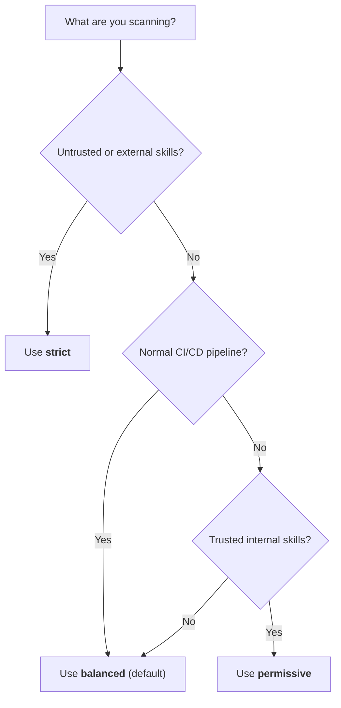

# Scan Policies Overview

Scan policies define scanner behavior without code changes.

## Which Preset Should I Use?



## Built-In Presets

| Preset | Posture | Typical use |
|---|---|---|
| `strict` | Maximum sensitivity | Untrusted content and audits |
| `balanced` | Default blend | General CI usage |
| `permissive` | Lower noise | Trusted internal workflows |

## Quick Start

```bash
skill-scanner scan ./my-skill --policy strict
skill-scanner scan ./my-skill --policy balanced
skill-scanner generate-policy --preset balanced -o my_policy.yaml
```

## Merge Behavior

Custom policy files merge over defaults.

- Missing keys inherit defaults.
- Scalar fields override directly.
- Lists replace defaults (they do not append).

## High-Impact Sections

- `pipeline`: command-chain demotion and known installer handling
- `rule_scoping`: docs/code/scope gating
- `file_limits`: max files, file size, depth
- `analysis_thresholds`: thresholds for analyzability and unicode heuristics
- `severity_overrides`: per-rule severity remapping

## Next Step

For exhaustive knob-by-knob documentation, see [Custom Policy Configuration](custom-policy-configuration.md).
